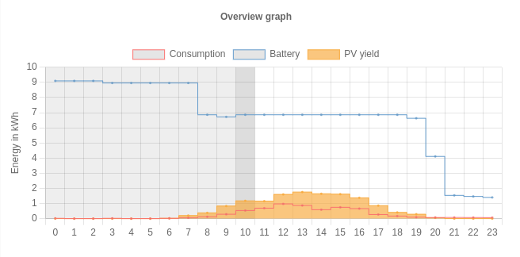
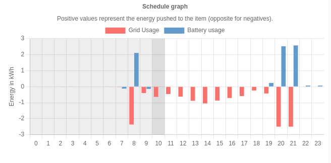
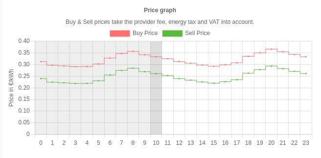
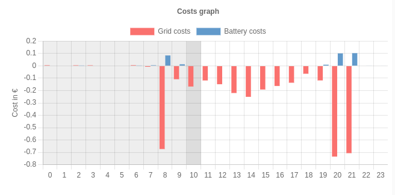
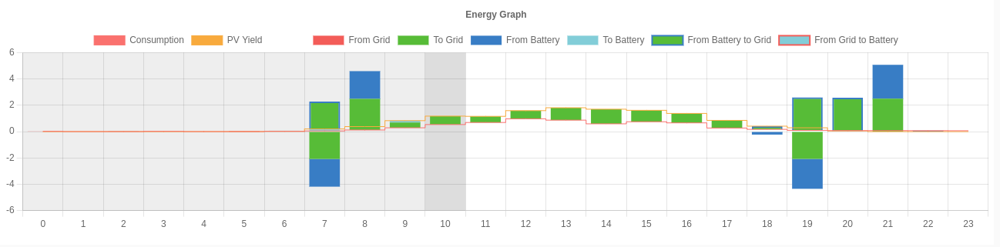
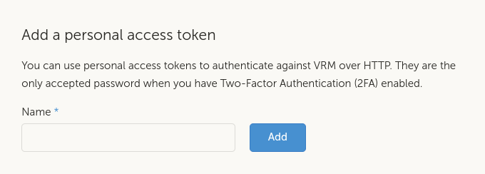
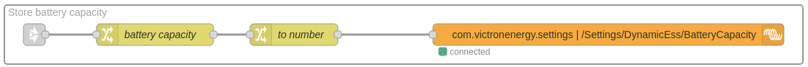

# Dynamic ESS

A Node-RED flow that uses VRM forecasting and algorithm to optimize when to sell, buy and hold the grid to zero. For use in systems that have hourly day ahead prices, which is the case in a big part of Europe.

Note that this is a proof-of-concept. Do check the [about](#about) and  [disclaimer](#disclaimer) below for more information

If you are upgrading, make sure to read the [RELEASE-NOTES.md](./RELEASE-NOTES.md) file as well.

# Prerequisites

In order to successfuly use this node, installations must:  
- Be an ESS (Energy Storage System)
- Have a dynamic energy contract
- Not use generators
- Not be mobile
- For best results:
  - Have 28 days of operation time
  - Have location set for at least 28 days
- Run at least version 3.10 of Venus OS (latest or candidate)
- Not be running the VRM implementation of Dynamic ESS, as this will bite each other. The service `com.victronenergy.settings` and path `/Settings/DynamicEss/Mode` is used for this. Mode `1` (auto) is used by VRM. Mode `4` (Node-RED) can be used for Node-RED implementations.

# QuickStart

- Install the following nodes via the palette manager:
  - `victron-dynamic-ess`
- Set your sites location in VRM.
- Import the _fetch-dynamic-ess_ flow..
- Configure the _Victron Dynamic ESS_ node.
- Deploy the flow and check [the dashboard](https://venus.local:1881/dess).

All of the parts are written down in more detail below.
If you use this and have questions, issues and/or suggestions, please ask them in the [Node-RED space](https://community.victronenergy.com/smart-spaces/71/node-red.html) of our community or file and issue on the [GitHub](https://github.com/victronenergy/dynamic-ess/issues) site.

## Installing required nodes

From the palette manager, install the following nodes:
- [victron-dynamic-ess](https://flows.nodered.org/node/victron-dynamic-ess)

Below is a short screen recording showing how to install them.


Node-RED also has documentation on [adding nodes](https://nodered.org/docs/user-guide/runtime/adding-nodes).

## Set your location in VRM

Make sure that you set your sites position correctly in VRM, as that is used for determining the predicted solar forecast. This can be set under _Settings -> Set location_ in VRM for your site.

## Importing the _fetch-dynamic-ess_ flow

Import the [_fetch-dynamic-ess_ flow](https://github.com/victronenergy/dynamic-ess/blob/main/examples/fetch-dynamic-ess.json) (ctrl-i). Once imported, double-click the _Dynamic ESS VRM_ node and fill out all required fields.


The imported flow looks like this:


Note that there also exists another flow that you can import: [_fetch-dynamic-ess-with-average-price-switching.json_](https://github.com/victronenergy/dynamic-ess/blob/main/examples/fetch-dynamic-ess-with-average-price-switching.json). This flow shows how to switch on/off a relay based on the average (dynamic) price.

If you want to link to the site from a dashboard node, you can simply add a template node that links
to the site:
```
[{"id":"46b70ef9a19626f0","type":"ui_template","z":"ccbcca84c2779cd2","group":"ab8b2a192b041af5","name":"","order":0,"width":0,"height":0,"format":"<a href=\"/dess\">Dynamic ESS</a>","storeOutMessages":true,"fwdInMessages":true,"resendOnRefresh":true,"templateScope":"local","className":"","x":860,"y":860,"wires":[[]]},{"id":"ab8b2a192b041af5","type":"ui_group","name":"Dynamic ESS","tab":"cc1a49b54f71c790","order":2,"disp":false,"width":"20","collapse":false,"className":""},{"id":"cc1a49b54f71c790","type":"ui_tab","name":"Dynamic ESS","icon":"dashboard","order":1,"disabled":false,"hidden":false}]
```

## Configuration of the Victron Dynamic ESS node


Double click the _Dynamic ESS VRM site_ to open the edit panel to configure the node. The following
fields need to be filled out:

- VRM token - The VRM access token. See [below](#create-an-access-token) on how to create one for your site.
- VRM portal ID - the VRM Portal ID can be found in the menu _Settings -> VRM Logger_ and on VRM under the _Device list -> Gateway_. It looks like this: `c0619ab27f32`
- B\_max - Battery capacity (in kWh)
- tb\_max - Maximum Battery charge power (in kW)
- fb\_max  - Maximum Battery discharge power (in kW)
- tg\_max - Maximum Grid Export power (in kW)
- fg\_max - Maximum Grid Import power (in kW).
- Battery cycle costs - Cost of charging *and* discharging battery (in €/kWh).
- Feed in possible - Can you sell back to the grid?
- Feed-in control - Allow control over the feed-in variable (turn it off automatically when the prices are negative)?

Battery cycle costs indicate how expensive it is to do a cycle of charging and discharging the battery, ex
pressed in €/kWh. A typical calculation for this is:  
> costs for buying the battery in € / (charging cycles * battery capacity in kWh)

One battery charge cycle equals full battery charged to 100% and fully used to 0%. If you only use half of the battery power, then recharge it and repeat it the following day — it will also count as one charge cycle instead of two. The number of charging cycles is a number that differs per brand.  The battery costs is usually somewhere between € 0.02 and € 0.06 /kWh.  
Some feedback of users is that they don’t care about the battery costs, as they already paid for it, so technically there’s no additional costs to charge it. In that case we still advise to put a small amount in as battery costs. E.g. 0.01 €/kWh.

The other thing to configure is the _buy price formula_ and _sell price formula_ (if you are allowed to sell back to the grid). This formula looks typically something like: `(p+0.02+0.13)*1.21`. It this example it breaks down to:  
- p - the dynamic price / kWh
- € 0.02 - energy provider profit share
- € 0.13 - DSO working price + contributions/levy/taxes
- 21% - tax

The sell price formula looks often identical and in common cases looks something like `(p-0.02+0.13)*1.21`. So the energy provider profit share works the other way around.

With different providers, the formula will likely be different. So this does require some research on how your pricing is build up.

The default filled out values are typical values. If you think you are factors of, you might want to consult on the [community](https://community.victronenergy.com/index.html) and ask for advice on what to fill out.

Once everything is filled out, you can deploy the flow and check https://venus.local:1881/dess/ to see how the system will take its actions for the day.

# Used dbus paths

When correctly deployed, these nodes do write (and read) from the dbus (using [node-red-contrib-victron](https://github.com/victronenergy/node-red-contrib-victron) nodes).
The following services and paths are being written to:  
- `com.victronenergy.settings /Settings/DynamicESS/Mode` - The mode of Dynamic ESS will be set to 'auto'
- `com.victronenergy.settings /Settings/DynamicESS/Schedule/*/*` - Depending on the used flow 1 or more schedules are written to, containing the desired Soc, AllowGridFeedin, Start and Duration.

# Graphs

On each input, the flow generates fresh graphs, which are displayed on the [https://venus.local:1881/dess](https://venus.local:1881/dess) page. Light gray background on the charts display the recorded values, while the transparent background shows the estimated/planned values. The darker gray part designates the current hour.

  
  
  
  


As soon as the new tarrifs are available, the mode will change from 24 hours into 48 hours.

# Usage

As the information is being retrieved via the [VRM API](https://vrm-api-docs.victronenergy.com/#/), a token is needed to be able to get the required information. This token will then be used instead of your VRM credentials. See [create an access token](#create_an_access_token) below on how to do that.

While it is probably possible to deduct the country based on the longitude and latitude, it is a lot easier if you fill it out yourself. So you will need to fill out the country as well. This information is used to retrieve the current energy price from ENTSO-E. ENTSO-E is the European association for the cooperation of transmission system operators (TSOs) for electricity. All EU countries use this as source for determining their next day dynamic energy prices.

# Create an access token

In order to use the _dynamic ess_ node, you will need an VRM API access token.  Creating such a token can be done from the VRM site. The process is described below.



Go to the [access token](https://vrm.victronenergy.com/access-tokens) part of VRM and add a new token. Name the new token _Node-RED dynamic ESS_ or something that your mind will link
to dynamic ESS. Once generated, store the access token in your password vault as you won't be able to retrieve it again. You will also need to fill out this token in the _dynamic ess_ node.

# Troubleshooting

## The node fails with the message `cannot create feasible schedule`

Make sure you have the timezone of your GX device set to match the timezone of your country. If that
does not match, it cannot create a feasible schedule (and thus reports that). 
So go to the (remote) console to _Settings_ -> _Date & Time_ -> _Time zone_ and set the correct
time zone. Note that a restart of Node-RED will be needed as well after changing the time zone.
This can be done either by rebooting the system or disabling and enabling Node-RED via the 
menu.

## The battery discharges less and less each day

You probably have the battery set to _Optimized (with batterylife)_. As long as the battery does not
reach 100% state of charge (which it probably does not reach while running Dynamic ESS), it will
increase the Active Min SOC each day by 5% until it reaches 100%. This gives Dynamic ESS less space
to play. At the moment Dynamic ESS has no way of coping with this. The current work-a-round is to either
accept this behavior or set the mode to _Optimized (without BatteryLife)_ and
periodically disable Dynamic ESS and charge your battery yourself.

## The console shows Dynamic ESS mode "_Unknown_"

As the VRM version of Dynamic ESS and the Node-RED variant should not be biting each other, both use
different modes. Mode `1` is reserved for VRM, showing _Auto_,  mode `4` is
reserved for _Node-RED_, showing "_Unknown_" on the console. This is expected behavior.

## The battery (dis)charges too slow to keep up with the target SOC

The Venus OS needs to know the battery capacity in order to make the correct calculation, which
defaults to 2 kWh (if not set). The following flow adds setting the battery capacity from Node-RED.
You can import this via ctrl-i / command-i / the import menu and pasting it into the red area.  

```
[{"id":"11c0695b7819894f","type":"group","z":"9a54b4bbc1a25e38","name":"Store battery capacity","style":{"label":true},"nodes":["e9a9bebc9c4732d0","b48a8f507e14330a","b68ffdbbf4152cf3","8d723ea6a3f644bc"],"x":54,"y":899,"w":1092,"h":82},{"id":"e9a9bebc9c4732d0","type":"change","z":"9a54b4bbc1a25e38","g":"11c0695b7819894f","name":"battery capacity","rules":[{"t":"set","p":"payload","pt":"msg","to":"dess.options.b_max","tot":"flow"}],"action":"","property":"","from":"","to":"","reg":false,"x":260,"y":940,"wires":[["b68ffdbbf4152cf3"]]},{"id":"b48a8f507e14330a","type":"victron-output-custom","z":"9a54b4bbc1a25e38","g":"11c0695b7819894f","service":"com.victronenergy.settings","path":"/Settings/DynamicEss/BatteryCapacity","serviceObj":{"service":"com.victronenergy.settings","name":"com.victronenergy.settings"},"pathObj":{"path":"/Settings/DynamicEss/BatteryCapacity","name":"/Settings/DynamicEss/BatteryCapacity","type":"number"},"name":"","onlyChanges":false,"x":880,"y":940,"wires":[]},{"id":"b68ffdbbf4152cf3","type":"change","z":"9a54b4bbc1a25e38","g":"11c0695b7819894f","name":"to number","rules":[{"t":"set","p":"payload","pt":"msg","to":"$number(payload)","tot":"jsonata"}],"action":"","property":"","from":"","to":"","reg":false,"x":450,"y":940,"wires":[["b48a8f507e14330a"]]},{"id":"8d723ea6a3f644bc","type":"link in","z":"9a54b4bbc1a25e38","g":"11c0695b7819894f","name":"link in 1","links":["0a258a4a88409834","fa866313f9c8bebf"],"x":95,"y":940,"wires":[["e9a9bebc9c4732d0"]]}]
```

When correct, it looks like this:  


Put it on the canvas and redeploy the flow. You can also check the set
battery capacity by reading from service `com.victronenergy.settings`
and path `Settings/DynamicEss/BatteryCapacity` (e.g. by using the 
custom input node).

## My battery stays fuller and fuller each day

The system works with the minimum SOC. In case you have set your system
to _Optimized (with BatteryLife)_, the system will still try to get a
full charge and increase the active SOC limit each day by 5% until it
reaches 100%.

If Active SOC limit is larger than min SOC, then that is seen as the minimum SOC the
battery can be in, hence the model tries to schedule with that limitation.

If you don't want this, set your ESS mode to _Optimized (without BatteryLife)_
and make sure to charge your battery manually periodically.

## Restrictions

Since candidate release 3.20~17 there is a `com.victronenergy.settings` / `Settings/DynamicESS/Restrictions` field for setting certain restrictions to the system. Currently there are the following options:

- `0` = No restrictions
- `1` = No exporting from battery to grid
- `2` = No importing from grid to battery

The following flow can be used for that:
```
[{"id":"4ce5aae7de47bc94","type":"victron-output-custom","z":"a2d2c9f4739759d4","service":"com.victronenergy.settings","path":"/Settings/DynamicEss/Restrictions","serviceObj":{"service":"com.victronenergy.settings","name":"com.victronenergy.settings"},"pathObj":{"path":"/Settings/DynamicEss/Restrictions","name":"/Settings/DynamicEss/Restrictions","type":"number"},"name":"","onlyChanges":false,"x":810,"y":460,"wires":[]},{"id":"b823ba313cf1f7e6","type":"inject","z":"a2d2c9f4739759d4","name":"0 - No restrictions","props":[{"p":"payload"},{"p":"topic","vt":"str"}],"repeat":"","crontab":"","once":false,"onceDelay":0.1,"topic":"","payload":"0","payloadType":"num","x":300,"y":460,"wires":[["4ce5aae7de47bc94"]]},{"id":"b9a38621ba13bb0b","type":"inject","z":"a2d2c9f4739759d4","name":"1 - No exporting from battery to grid","props":[{"p":"payload"},{"p":"topic","vt":"str"}],"repeat":"","crontab":"","once":false,"onceDelay":0.1,"topic":"","payload":"1","payloadType":"num","x":360,"y":500,"wires":[["4ce5aae7de47bc94"]]},{"id":"3895c5f36826be0f","type":"inject","z":"a2d2c9f4739759d4","name":"2 - No importing from grid to battery","props":[{"p":"payload"},{"p":"topic","vt":"str"}],"repeat":"","crontab":"","once":false,"onceDelay":0.1,"topic":"","payload":"2","payloadType":"num","x":360,"y":540,"wires":[["4ce5aae7de47bc94"]]}]
```

Since candidate release 3.20~30 also per-timeslot restrictions got added. The latest importable flows support this. Note that the global restrictions have leading priority. So if that one is set to _No exporting from battery to grid_, the per-timeslot restriction cannot overrule that.

## System efficiency

The efficiency of the ESS system is considered (by default) to be 90%,
meaning that if your solar yield is 10kWh and you put that in your battery,
you are able to only pull 9kWh back out of it (for either consumption or
selling to the grid). Note that this is not only the efficency of the battery,
but also includes inverter losses.

It can be adjusted (since candidate release 3.20~17) via the `com.victronenergy.settings` / `Settings/DynamicEss/SystemEfficiency` dbus path. If you want to adjust it to e.g. 85%, you can
use the following flow:
```
[{"id":"8d63274285babe24","type":"victron-output-custom","z":"a2d2c9f4739759d4","service":"com.victronenergy.settings","path":"/Settings/DynamicEss/SystemEfficiency","serviceObj":{"service":"com.victronenergy.settings","name":"com.victronenergy.settings"},"pathObj":{"path":"/Settings/DynamicEss/SystemEfficiency","name":"/Settings/DynamicEss/SystemEfficiency","type":"number"},"name":"","onlyChanges":false,"x":490,"y":220,"wires":[]},{"id":"0a6927f3647c0285","type":"inject","z":"a2d2c9f4739759d4","name":"","props":[{"p":"payload"},{"p":"topic","vt":"str"}],"repeat":"","crontab":"","once":false,"onceDelay":0.1,"topic":"","payload":"85","payloadType":"num","x":110,"y":220,"wires":[["8d63274285babe24"]]}]
```

# About

The goal of Dynamic ESS can be formulated in the following way:  
- Minimize the costs made on the grid and battery,
- By using the grid and battery to indirectly control the energy flow,
- While taking the consumption estimates, PV yield estimates, grid limitations, battery limitations and energy prices into account.

By taking the mentioned factors into account, Dynamic ESS builds a comprehensive model of the site to be able to generate a schedule of battery and grid usage for the installation to follow throughout the day to minimize its costs.

The algorithm does consider tomorrow's prices, consumption and PV yield estimates (from the moment tomorrow's prices are published). This is not expressed visually on the graphs because Node-RED implementation is only a proof-of-concept.

# Disclaimer

- This is a proof of concept project. In the future this implementation in Node-RED will become obsolete as the functionality will move into VRM/Venus OS native.
- This flow uses control paths that may interfere with your normal GX device usage. It adjusts settings (setpoint) and will insert a schedule for charging in the ESS menu. If you don't want that, don't use this node. See below which dbus paths are being used.
- When the API gets updated, there is a fair change that the node also needs to be updated. The API will respond with a `426` / Please update http status code.


