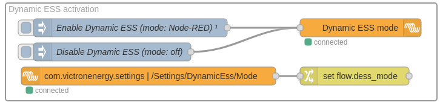
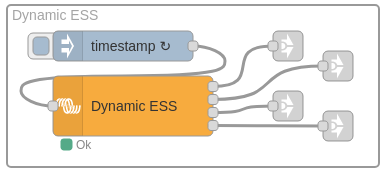
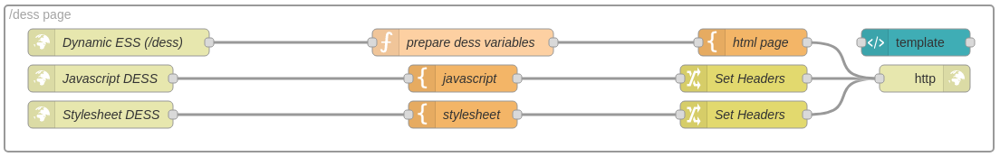
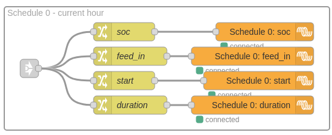

# Release notes

If you have been running an older version of Dynamic ESS you will
want to read through this text, as it gives you more understanding
on the underlying system and will answer some of your questions.

# General

The current version no longer sets the setpoint, but works with a
_target SOC_. The system takes the current hour to match the batteries
SOC with the target SOC. This can be done by either charging (via
solar or grid) or discharging to the grid. It does this by following
schedules which require a target SOC, start, duration and feed\_in
flag.

Configuration no longer uses the site ID, but switched to the more
common VRM portal ID (you can find that under the _Device list -> Gateway_
and then _VRM portal ID_).

The rest of the configuration is still the same. See the
[README.md](./README.md) file for more information on that.

## New flow

There is a new flow, which you can import from the examples.
This new flow looks totally different than the old one, so lets
highlight all of the changes.

First of all, this new flow uses the new custom input and output
control nodes, which are part of the `node-red-contrib-victron`
palette.

The system also stores the fetched information in the context,
so if you want to check the data or visualize it on another
way, check the flows context for:
- `dess`
- `dess_config`
- `dess_mode`
- `lastValidUpdate`

These values are being updated while the system runs and are
used by the web page `/dess` (see below).

### Dynamic ESS activation

There are currently 5 different ESS modes:
- `0` - off
- `1` - Auto (reserved for the VRM implementation)
- `2` - Buy (reserved for the VRM implementation)
- `3` - Sell (reserved for the VRM implementation)
- `4` - Node-RED (to be used by the Node-RED implemenation)

The activation part of the flow sets the Dynamic ESS mode to
mode `4` (Node-RED) on deploy. It also reads the mode back
from the dbus, in case the mode gets changed via another
mechanism then Node-RED.

### Dynamic ESS

The node now has 4 new outputs and automatically periodically
fetches new data and outputs 4 schedules. The input is no
longer required (but can be handy when debugging).

On the changing of the hour the new schedules will be outputted,
but also every 12 minutes. 

### /dess page

The system no longer uses the dashboard nodes, because they
seemed to bite each other. So that is why we decided to drop
the need for the dashboard and host the Dynamic ESS graphs
on its own url instead: https://venus.local:1881/dess

This is accomplished by using a few http nodes, templates
and functions. If you want to modify the html page, please
take a look at the "html page" template node.

### Schedule 0-4

The Dynamic ESS implementation on Venus OS works
with schedules that carry a start, duration, target SOC and
feed\_in flag.

The system tries to get the battery SOC to the target SOC
with in _duration_ seconds, starting at the unix timestamp
_start_. If _feed\_in_ is set, the system is allowed to
feed in to the grid.

The duration on the flow will always be `3600` seconds (1 hour).
The rest of the information is fetched from the vrm API.

### Store battery capacity

In order to make good predictions, we'd like to store the 
battery capacity on the dbus as well. This part of the flow
stores the capacity.
